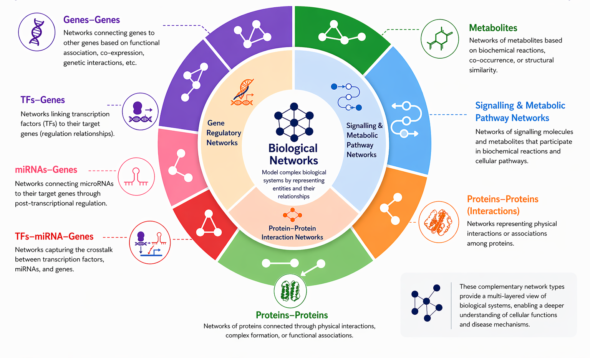
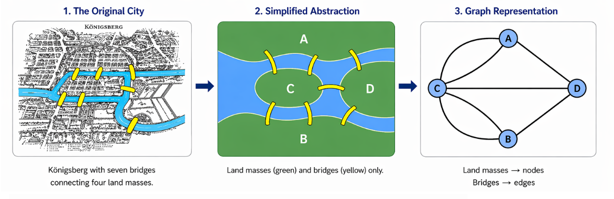
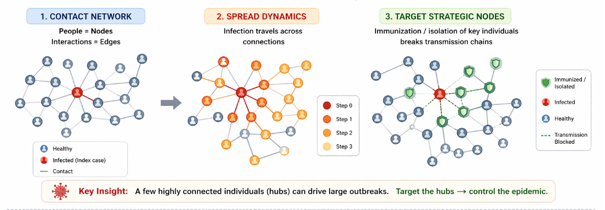

# Understanding Biological Networks

## What is a Network?

A network is a graph which is represented in the form of nodes (vertices) and edges. In general, it is used for data visualization as well as an approach to analyze data. Usually, recent times have experienced an upsurge of interest in using networks due to Big Data. Broad application of networks have been successfully done in Social Network Analysis, Biological Network Analysis.  

In social systems:

* Nodes → persons, organizations, places
* Edges → friendships, collaborations, geographical maps

In biological systems:

* Nodes → genes, proteins, metabolites
* Edges → interactions (binding, regulation, co-expression)

> **Key Insight**: Biology is not about individual components but their interactions.

---

## Biological Networks

* As simple is that Biological networks are networks constructed from/on biological data. In general cases the nodes represent biological components and the edges, association or regulations among them.

* Unlike social networks and other similar kind of networks, biological networks in general are more complex.

* It is a tedious job to model these networks using the conventional mathematical approaches.

* Hybrid statistical methods can help to understand and gain deeper insight into various biological networks.

## Types of Biological Networks

### Protein-Protein Interaction (PPI)

* Nodes: Proteins
* Edges: Physical interactions

### Gene Regulatory Networks (GRN)

* Nodes: Genes, TFs, miRNAs
* Edges: Regulatory control

### Metabolic Networks

* Nodes: Metabolites
* Edges: Reactions

### Functional Networks

* Based on Gene Ontology and annotations

---

## Complexity in Biological Networks

Biological networks exhibit:

* Dynamic behavior
* Context dependency
* Noise and stochasticity
* Feedback loops
* Emergent properties

> These features make biological systems highly complex and require computational approaches.

---

## Graph Theory

### Mathematical Representation of Graph (Network)
A network could be represented using mathematical representation of relationships between entities and in the graph theory, it is formally defined as:

$$
G = (V, E)
$$

Where:

* $V$ represents nodes (vertices)
* $E$ represents edges (connections)

### History of Graph Theory

The origins of graph theory can be traced back to an 18th-century puzzle known as the **Seven Bridges of Königsberg**. In the city of Königsberg (now Kaliningrad), four land masses were connected by seven bridges. The question posed to citizens was simple:

> *Is it possible to cross all seven bridges exactly once without repeating any?*

To solve this, mathematician **Leonhard Euler** (1736) introduced a revolutionary way of thinking. Instead of focusing on the geographical layout, he abstracted the problem:

- **Land masses → Nodes (vertices)**
- **Bridges → Edges (connections)**

This abstraction transformed a real-world navigation problem into a mathematical structure — a **graph**.

Euler demonstrated that such a path does **not exist**, because the network structure violates necessary conditions (specifically, more than two nodes have an odd number of connections). This result marked:

- The **first formal problem in graph theory**
- The birth of **network-based thinking**
- A shift from geometry to **connectivity-focused reasoning**

#### From Puzzle to Principle

The key insight from Euler’s work is:

> **It is not about the path you take, but how the system is connected.**

This idea forms the foundation of modern graph theory and extends far beyond mathematics.

---

### From Bridges to Biology

The same principles now apply across disciplines, especially in biology and data science.

- **People → Nodes**
- **Interactions → Edges**
- **Disease spreads through connections**

In epidemiology (e.g., COVID-19), graph theory helps us understand:

- How infections propagate through contact networks  
- Why **highly connected individuals (hubs)** drive outbreaks  
- How **targeted interventions** (vaccination, isolation) can break transmission chains  

Similarly, in molecular biology:

- **Proteins/genes → Nodes**
- **Interactions → Edges**
- Disrupting key nodes can alter entire biological pathways  

---

### Take-Home Message

Graph theory began with a simple question about bridges, but today it provides a universal framework to understand complex systems:

> **From cities to cells, systems are best understood through their connections.**

## Network Metrics

### Degree

Number of connections of a node

### Betweenness

Importance in information flow

### Closeness

Distance to all nodes

### Modularity

Community structure

---

## Minimum Dominating Set (MDS)

A Minimum Dominating Set is the smallest subset of nodes such that all nodes are either in the set or adjacent to it.

> Biological relevance: Minimal control set of genes/proteins

---

## 📌 Suggested Figures

* Basic node-edge diagram
* Directed vs undirected graph
* Biological network types (Circos / Sankey)
* MDS illustration
