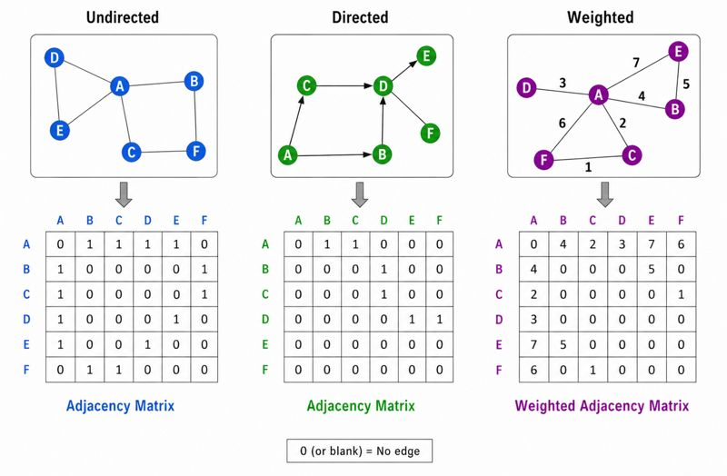
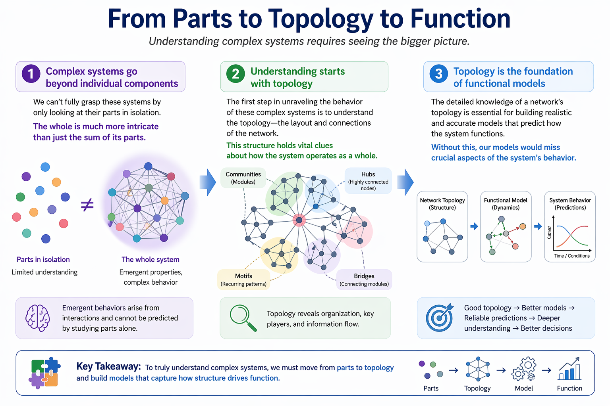
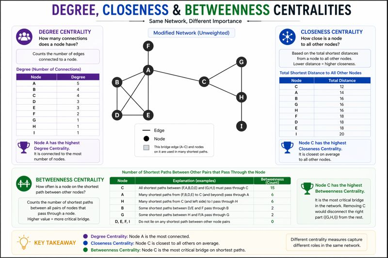

# Introduction to Graph Theory

## Mathematical Representation of Graph (Network)
A network could be represented using mathematical representation of relationships between entities and in the graph theory, it is formally defined as:

$$
G = (V, E)
$$

Where:

* $V$ represents nodes (vertices)
* $E$ represents edges (connections)

## History of Graph Theory

The origins of graph theory can be traced back to an 18th-century puzzle known as the **Seven Bridges of Königsberg**. In the city of Königsberg (now Kaliningrad), four land masses were connected by seven bridges. The question posed to citizens was simple:

> *Is it possible to cross all seven bridges exactly once without repeating any?*

To solve this, mathematician **Leonhard Euler** (1736) introduced a revolutionary way of thinking. Instead of focusing on the geographical layout, he abstracted the problem:

- **Land masses → Nodes (vertices)**
- **Bridges → Edges (connections)**

This abstraction transformed a real-world navigation problem into a mathematical structure — a **graph**.

Euler demonstrated that such a path does **not exist**, because the network structure violates necessary conditions (specifically, more than two nodes have an odd number of connections). This result marked:

- The **first formal problem in graph theory**
- The birth of **network-based thinking**
- A shift from geometry to **connectivity-focused reasoning**

### From Puzzle to Principle

The key insight from Euler’s work is:

> **It is not about the path you take, but how the system is connected.**

This idea forms the foundation of modern graph theory and extends far beyond mathematics.

---

## From Bridges to Biology

The same principles now apply across disciplines, especially in biology and data science.

- **People → Nodes**
- **Interactions → Edges**
- **Disease spreads through connections**

In epidemiology (e.g., COVID-19), graph theory helps us understand:

- How infections propagate through contact networks  
- Why **highly connected individuals (hubs)** drive outbreaks  
- How **targeted interventions** (vaccination, isolation) can break transmission chains  

Similarly, in molecular biology:

- **Proteins/genes → Nodes**
- **Interactions → Edges**
- Disrupting key nodes can alter entire biological pathways  

---

## Take-Home Message

Graph theory began with a simple question about bridges, but today it provides a universal framework to understand complex systems:

> **From cities to cells, systems are best understood through their connections.**

## Types of Networks

Broadly, networks are defined as directed and undirected networks. As the name suggests the networks where the edges represents a context which are directional conceptually, are directed networks. Usually the directed networks are represented in arrow type edges representing source and targets. For example, a TF-Gene network is always represented as directional network as this showcases the TF regulating the gene. On the other hand, PPIN can be presented in the form of undirected networks by using simple lines for the edge representation. There could be a network with both undirected and directed edge representations but these will be called broadly as a directed network.

## Mathematical representation of networks

All networks could be mathematically represented in the form of adjacency matrix. Number 1 and 0 could be simply used to represent if there is connection between 2 nodes or not. Further, if it is a weighted network where the edges have been defined with some kind of weights, the weights could be directly used instead of 1 in the adjacency network.

## Network Metrics

Studying the network topology is an immensely important task while analyzing any network. This let's understand the nature of data represented in the form of network as well as deciding on which approaches could be applied to the particular network. The below is an illustrative infograph representation for understanding network topology.

There are several network metrics, commonly also known as network properties which help in understanding the topology of a network as well as analyzing the network to identify key and important nodes w.r.t. various contexts. Some of these metrics are described below.

### Degree

Degree is one of the most importnat and widely used network property and mainly used for the identification of the most important nodes in a given network. The degree is defined as the number of connections of a node. 

### Betweenness

Importance in information flow and measures how often a node lies on the shortest paths between other nodes. A node with high betweenness acts as a bridge or bottleneck controlling information flow.

### Closeness

Distance to all nodes and measures how close a node is to all other nodes in the network (based on shortest path distances). A node with high closeness can reach others quickly and efficiently.

The figure below illustrates an example network and the metrics such as degree, closeness and betweenness centrality in the same network.

---

## Minimum Dominating Set (MDS)

A Minimum Dominating Set is the smallest subset of nodes such that all nodes are either in the set or adjacent to it.

> Biological relevance: Minimal control set of genes/proteins

---

## 📌 Suggested Figures

* Basic node-edge diagram
* Directed vs undirected graph
* Biological network types (Circos / Sankey)
* MDS illustration
