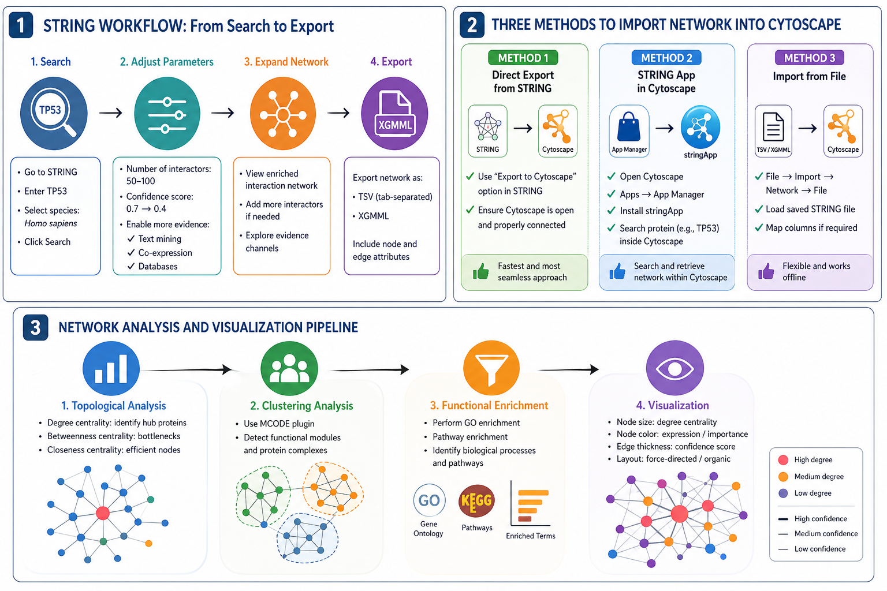

# Analyzing Biological Networks

## Bioinformatics Resources

There are many bioinformatics resources for constructing biological networks. There are databases and sources such as STRING, IntAct, etc. for the networks information extraction, visualization and even analysis. However, a proper and deeper analysis needs tools such as Cytoscape and Gephi. Cytoscape is the most widely used network visualization and analysis tools in the field of biology.

---

## STRING Database

The STRING database integrates known and predicted protein–protein interactions derived from experimental data, computational prediction, and literature mining.

### Key Features

* Interaction confidence scoring
* Multiple evidence channels (experimental, text mining, co-expression)
* Adjustable network parameters
* Export support for Cytoscape

---

## Example: PPI Network Analysis (TP53)

### Step 1: Network Construction

* Navigate to STRING database
* Enter **TP53**
* Select organism: *Homo sapiens*
* Click **Search** to generate the network

---

### Step 2: Increase Network Connectivity

To obtain a denser and more informative network:

* Increase **number of interactors** (e.g., 50–100)
* Reduce **confidence score threshold** (e.g., 0.7 → 0.4)
* Enable additional interaction sources:

  * Text mining
  * Co-expression
  * Database evidence
* Use **“Add more interactors”** option

---

### Infographic 1: STRING Workflow

---

## Summary

This workflow demonstrates how to construct, import, analyze, and visualize protein–protein interaction networks using STRING and Cytoscape. By adjusting parameters in STRING and leveraging Cytoscape’s analytical tools, biologically meaningful insights can be derived efficiently.

---

---

