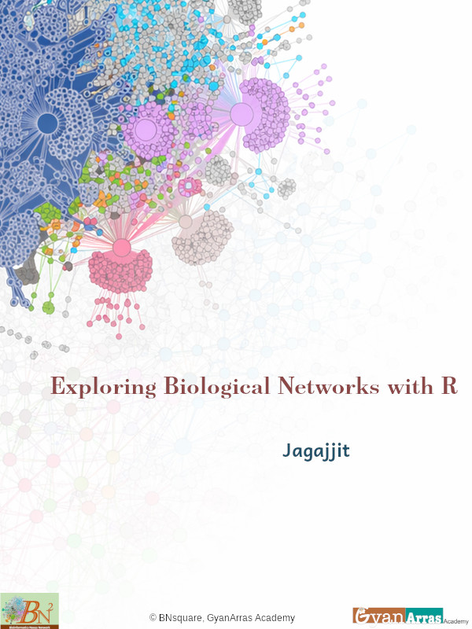

# Cover {-}

{width=100%}

\newpage

# Preface {-}

Biology has come a long way since the days where understanding the functions of individual parts was enough to comprehend the whole picture. Modern researches in biology is based on highly complex systems of genes, proteins and metabolites that work together. Their interactions are what determines the functioning of cells and disease mechanisms and studying these information in a systematic and system-wide manner would provide valuable insight. This is where network biology offers means to explore the complexity by shifting the focus from isolated entities to relationships and systems.

The book begins by presenting the basics of biological networks generally and moving on to the actual analysis using various bioinformatics resources including STRING, Cytoscape and R, with a special emphasis on clarity, applicability, and replicability. The rationale for the effort undertaken in this case comes from the increasing requirement to learn bioinformatics efficiently. Though several good tools and databases exist, the process of using them effectively in the context of analysis remains difficult. What is sought through this book is an attempt to overcome this problem with the help of an easy-to-use strategy.

In the course of reading each chapter, students will be introduced to important topics like network building, network topology analysis, centrality analysis, clustering, and visualization. It is not only that they are introduced as separate processes but as parts of an integrated system of analysis. Wherever applicable, biological applications are highlighted to facilitate comprehension of their scientific significance.

The target audience for this book consists of students, researchers, and practitioners in life sciences, bioinformatics, and other similar disciplines, who wish to integrate networking concepts into their studies or projects. Some biological knowledge and basic programming skills in R will be useful, although the book is designed to be understandable even for those without prior experience.

In looking to the future, there seems no doubt that the combination of network biology with other areas like multi-omics, machine learning, and systems medicine will change the way that biological systems are analyzed. Hopefully, this book is able to provide some insight for the reader on these areas and for him or her to find ways to analyze their own research.

This book is much more than just the techniques, but it is a way of thinking. The move from the components to the connections, and from the data to the insight.
